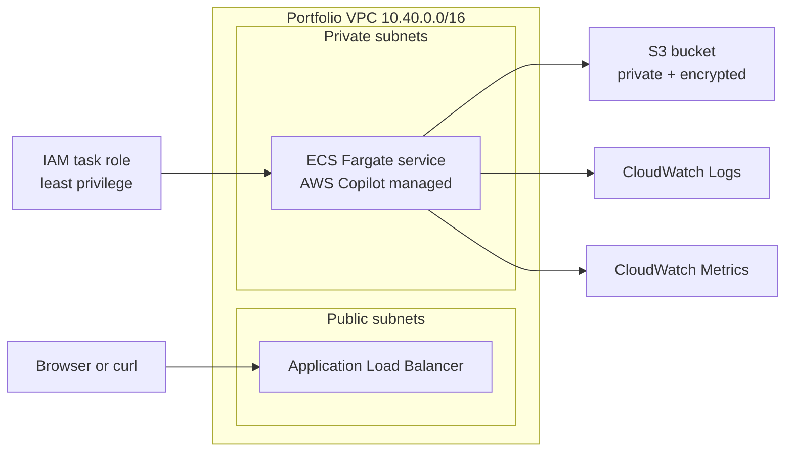

# AWS Cloud Lab Architecture

This project demonstrates a production-style baseline on AWS with a small Python web app, S3-backed storage, network isolation, least-privilege IAM, and CloudWatch observability.

## Logical architecture

## Components

- Application: Flask app containerized with Docker and deployed to ECS Fargate through AWS Copilot.
- Networking: CloudFormation template creates a reusable VPC with two public subnets, two private subnets, and two security groups.
- Storage: S3 bucket with versioning, AES-256 encryption, and public access blocked.
- Security: Separate IAM JSON examples show the recommended least-privilege approach and a broader temporary test policy.
- Observability: Logs stream from the container to CloudWatch Logs, while CPUUtilization metrics power the example alarm.

## Network design

- The load balancer security group allows inbound TCP/80 from the internet.
- The application security group allows inbound TCP/8080 only from the load balancer security group.
- Private subnets are intended for ECS tasks, which prevents direct inbound traffic to the container.

## Deployment options

- Fast path: Let AWS Copilot create the environment and deploy the service, then use the CloudFormation templates for S3, IAM, and alarms.
- Extended path: Use the included network template as your baseline VPC design and adapt the Copilot environment to match that network model.

## Monitoring workflow

1. Deploy the service with AWS Copilot.
2. Tail application logs with `copilot svc logs` or `aws logs tail`.
3. Deploy the alarm template with the Copilot-created ECS cluster and service names.
4. Call `/stress?seconds=20` a few times to generate CPU pressure and watch the alarm transition.
